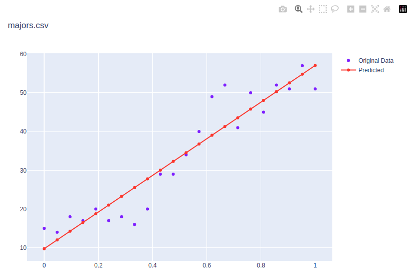

# XvY (XvsY) A Simple Linear Regression Calculator

## 19 Dec 2022


## Detail

This is a regression calculator of data column $x$ over data column $y$ from the input file. The output is an interactive graph.

## Data

The `csv` files will take the following form.

```
1,15
2,14
3,18
4,17
5,20
6,17
7,18
8,16
9,20
10,29
11,29
12,34
13,40
14,49
15,52
16,41
17,50
18,45
19,52
20,51
21,57
22,51
```

## Running the program

To run the program, enter the following commands.

* In the root directory of the project. Note this is where you will find the file, `pyproject.toml`
  + `poetry install`
* Run the program.
  + `poetry run xvy --data-file input/majors.csv`

## Output

In the terminal window, the y-predicted values will be shown. These values give the red line in the Plotly plot which is outputted.




## A work in progress

Check back often to see the evolution of the project!! Updates to the methods and tests for the code will come soon and I will continue to update the repository with updates. If you would like to contribute to this project, __then please do!__ For instance, if you see some low-hanging fruit or task that you could easily complete, that could add value to the project, then I would love to have your insight.

Otherwise, please create an Issue for bugs or errors. Since I am a teaching faculty member at Allegheny College, I may not have all the time necessary to quickly fix the bugs and so I would be very happy to have any help that I can get from the OpenSource community for any technological insight. Much thanks in advance. I hope that this project is helpful to you in some way. :-)
